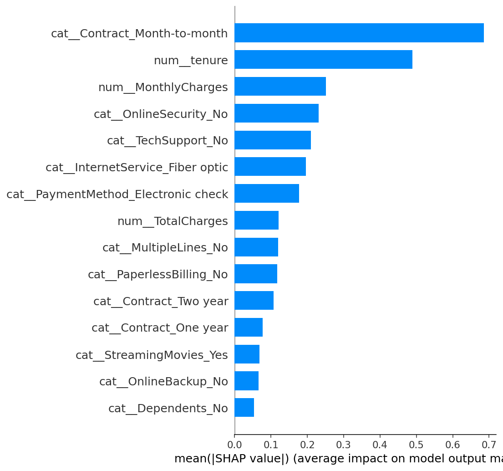

# Customer Churn Prediction

**An end-to-end machine learning project that predicts which telecom customers are about to cancel — and explains why.**

Live dashboard: *(add your Streamlit Cloud URL here after deploying)*

---

## The problem in one paragraph

A telecom company loses money every time a customer leaves. If we can identify the customers most likely to leave **before** they do, the retention team can act — with a discount, a call, a better plan — and save the revenue. This project takes a real dataset of 7,043 telecom customers, trains a model that flags high-risk customers with **79% recall**, and ships it as an interactive web dashboard that shows *why* each customer is at risk.

## Results at a glance

| Metric | Score | What it means |
|---|---|---|
| **ROC-AUC** | **0.844** | The model reliably ranks churners above non-churners. |
| **Recall (churn class)** | **0.79** | We catch 79% of the customers who will actually leave. |
| Precision | 0.52 | Roughly half the flagged customers really do churn (acceptable — a missed churner costs far more than a wasted retention offer). |
| F1 | 0.63 | Balanced view of precision + recall. |

**Winning model:** tuned XGBoost (`n_estimators=200, max_depth=3, learning_rate=0.05`) with `scale_pos_weight` for class imbalance.

## What drives churn (from SHAP)

The model doesn't just predict — it explains. The strongest churn signals across the dataset are:

1. **Month-to-month contracts** — churn at 42.7%, versus 2.8% for 2-year contracts.
2. **Short tenure** — the first year is the danger zone.
3. **High monthly bills** — churners pay $74/mo on average, stayers pay $61.
4. **No online security / no tech support** add-ons.
5. **Fiber-optic internet** — 41.9% churn rate (worth investigating on the business side).
6. **Electronic-check payment method.**

Plain English: **new, month-to-month, fiber-optic customers paying by electronic check with no support add-ons are the churn archetype.**

## Screenshots

*(Take these once you run the app locally and drop them here.)*

- `docs/dashboard_input.png` — the sidebar input form
- `docs/dashboard_result.png` — the risk score + SHAP explanation

Global SHAP summary already generated:



## How it was built

Explore → Plan → Implement, split into six phases with a git commit per phase:

| Phase | What | Where |
|---|---|---|
| 0 | Project scaffolding | folder layout, requirements, CLAUDE.md |
| 1 | EDA and data cleaning | [notebooks/eda.ipynb](notebooks/eda.ipynb), [src/data.py](src/data.py) |
| 2 | Preprocessing pipeline | [src/preprocess.py](src/preprocess.py) — `ColumnTransformer`, split **before** fit |
| 3 | Model training and selection | [src/train.py](src/train.py) — 3 candidates, 5-fold stratified CV, tuning |
| 4 | SHAP explainability | [src/explain.py](src/explain.py) — global + local plots |
| 5 | Streamlit dashboard | [app/app.py](app/app.py) |
| 6 | Documentation | this README |

### Engineering choices worth calling out

- **No data leakage.** The preprocessor is fit only on training data (see the `__main__` block of `src/preprocess.py`).
- **Cross-validation, not a single split.** Every reported score is a 5-fold stratified average.
- **Class imbalance handled explicitly** with `class_weight='balanced'` and `scale_pos_weight`. I chose this over SMOTE because weighting stays inside the CV fold naturally and needs less machinery than synthesising rows.
- **Recall over accuracy.** A "predict stayed" model would score 73.5% accuracy and be useless. In churn, missing a leaver is more expensive than a false alarm, so the primary metric is ROC-AUC + recall.
- **Every artefact is reproducible.** Cleaning, splitting, training, SHAP, and the app all import the same `src/` functions — no logic hidden in the notebook.

## Tech stack

Python 3.12 · pandas · scikit-learn · XGBoost · SHAP · Streamlit · matplotlib · seaborn · joblib

## Dataset

[IBM Telco Customer Churn](https://www.kaggle.com/datasets/blastchar/telco-customer-churn) — 7,043 customers, 20 features, binary target. The raw CSV is included in `data/raw/`.

## Run it locally

```bash
git clone <your-repo-url>
cd churn-prediction

pip install -r requirements.txt

# 1. Clean the raw data → data/processed/telco_clean.csv
python -m src.data

# 2. Train + tune + save the model → models/churn_model.joblib
python -m src.train

# 3. Generate SHAP plots → models/shap_*.png
python -m src.explain

# 4. Launch the dashboard
streamlit run app/app.py
```

Then open [http://localhost:8501](http://localhost:8501).

## Deploy to Streamlit Community Cloud

Streamlit Cloud hosts public Streamlit apps for free directly from a GitHub repo. To deploy:

1. Push this repository to a **public** GitHub repo.
2. Go to [share.streamlit.io](https://share.streamlit.io) and sign in with GitHub.
3. Click **New app**, then select:
   - **Repository:** `<your-github-username>/churn-prediction`
   - **Branch:** `main`
   - **Main file path:** `app/app.py`
4. Click **Deploy**. Streamlit will install the pinned dependencies from `requirements.txt` and boot the app.
5. Once live, paste the app URL into the top of this README (under "Live dashboard").

Notes:
- The trained model file (`models/churn_model.joblib`) needs to be committed so the cloud runtime can load it. It's ~1 MB, safely under the 100 MB GitHub file limit.
- No secrets or API keys are needed for this project.

## Project structure

```
churn-prediction/
├── app/
│   └── app.py              # Streamlit dashboard
├── data/
│   ├── raw/                # Original Telco CSV
│   └── processed/          # Cleaned dataset
├── models/                 # Trained model + SHAP plots + metrics
├── notebooks/
│   └── eda.ipynb           # Exploratory analysis + storytelling
├── src/                    # Importable modules (all core logic lives here)
│   ├── data.py             # Load + clean
│   ├── preprocess.py       # ColumnTransformer + split-before-fit
│   ├── train.py            # 3 candidates → CV → tune → save
│   └── explain.py          # SHAP analysis
├── requirements.txt
├── CLAUDE.md               # Conventions + project brief
└── README.md
```

## About

Built by **Eyad Alarfaj** as a portfolio project for junior Data Scientist / ML Engineer roles.
Contact: eyad999.fahad@gmail.com
